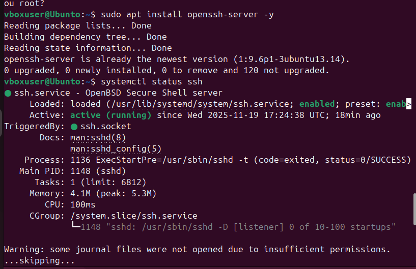
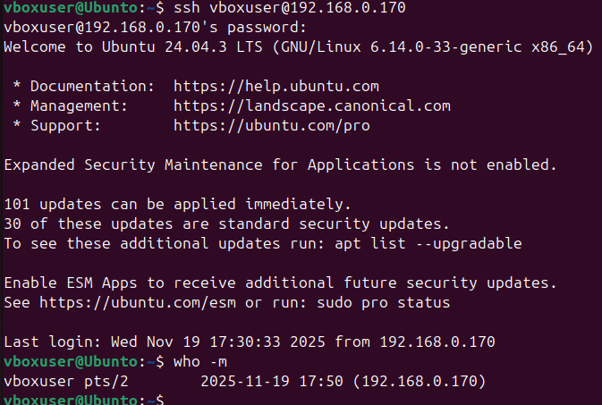
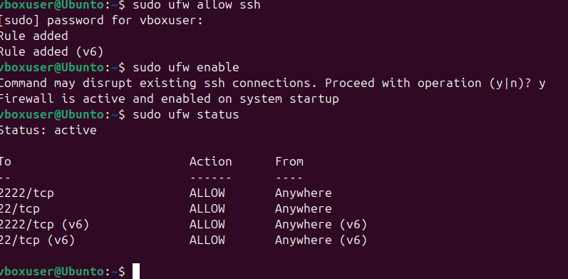

**1**.Selectapplicationsrepresentingdifferentworkload
types(e.g.CPU-intensive,
RAMintensive,I/O-intensive,Network-intensive,and Server
applicationssuchasgame servers) for performanceevaluationand
createanApplicationSelectionMatrixlisting
applicationswithjustificationsfor choosingthem.

||
||
||
||
||
||
||
||

**Task2:**

FirstlyIneeded tousewhoamitofind theusernamewhichwasvboxuser.

Thenusingip atofind theiptoconnecttoSSH.

thisisthecommand I'veused toconnecttossh:
ssh[<u>vboxuser@192.168.0.170</u>](mailto:vboxuser@192.168.0.170)

sudoaptupdate,toupdatethesystem,

sudoaptinstallopenssh-server –y,istallthesshserver thatallowsremotelogin

thenused
“systemctlstatusssh”tocheckifthesystem isrunning.And itwasshowing
activerunning

Ialsoadded UFWrules,iffirewallisenabled,IallowSSH

**Task** **3:** **Expected** **resources** **Profile**
Thissectionwillhavetheresourceusageofeachselected
applicationbeforeperformance

testingisdone.Theprofilewilldescribethecpuload, memoryload,diskload,and
network.Thesewillbefrom normalbenchmarkingtools.

1.CpuIntensive

Firstwascpuintensiveusingstress –ng,itputsalotofload
onthecpubyrunningmultiple threads.

Iexpect:

Cpuusagetobeextremelyhigh90-100%

Ram usagewillbelowtomoderate100-500MB mostlyfrom code

Diskusageshould staythesameasbasevaluesasittestingmainlythecpu

Networkalsoshould staythesameasitsatestonthecpuand hasnothingtodowiththe
network.

||
||
||
||
||
||
||

2.RamIntensive

Using–vmthiswillstresstheram byallocatingmemory Iexpect:

Cpuusagetobemoderateasmemoryrequirescpusupport

Ram usagetobeExtremelyHigh-alsodependsonthevaluethatispassed,for example
--vm-bytes2G willallocate2GB ofram

DiskUsage:

Noneasitonlystressestheram

Network:

None.

||
||
||
||
||

||
||
||
||

3.DiskI/O intensive

Usingthecommand ddthatwriteslargefilesand measuresdiskthroughput.

Expected Usage:

Cpu,Iexpectittobeverylow

Ram,alsoshould beverylowalmostbaseline

Disk,Veryhighasitwillbeusingittowriteand read largefile.Command
exampleddif-/dev/zeroof=test filebs=1gcount=1,whichwrites1GB

Network,none

||
||
||
||
||
||
||

4.NetworkIntensive

Measurenetworkactivitybetweenaclientandaserver

Expected usage:

Cpu,usagemoderateduetohighspeedsnetwork

Ram,low

Disk,low

Network,ExtremelyHigh–saturatesavailablebandwidth100-1000MBPS

||
||
||
||
||
||
||

5.Server typeapplication

Astandard HTTPweb server used tosimulateserver behavior

Expected usage:

Cpu,lowatidle,butmoderatewhileunder loadtesting

Ram Usage:

Moderate200-400MB dependingontheloadsofthecpuand whatisbeingused

Disk:

Lowtomoderate, savingfilesand doingother activities

Networkusage:

Moderatetohighdependingontheamountofrequestsarebeingsentfrom andtothe
server.

||
||
||
||
||
||
||

Task4:MonitoringStrategyfor performanceEvaluation
Intask4Iwillbemonitoringapproachused toevaluateresourceusagefor
eachselected
application,cpu,ram,disk,networkandserver.Acombinationoftimeand recorded
monitoringtoolsisused tocapturetheperformanceand resource
usageofthecpu,ram, diskandnetwork.

Commandstoinstallsomeofthemonitoringsystems.

sudoaptupdate(updatesallofthesystemstomakesureeverythingworksgood,alsothe
installingprocessworkssmoothly)

sudoaptinstallstress-ngfioiperf3apache2 –y(someofthetoolsthatwewilluseto
monitor specificor multiplecomponentsand theirperformance.)

1.CpuMonitoring

Commands:

> • Top • Htop
>
> • Mpstat

Top and htopgiverealtimecpuusageand showhowmucheachapplicationusses

Mpstatgiveaccuratecpuusageover timeacrossallcores

Iwillstartwith<u>htop.</u>Thenusestress-ng–cpu4–timeout60s

Iwillrecord :

Cpu%per core

Load average

Temperature

Tologthedata:

Mpstat160,thiswillcapturecpuusageeverysecond for60seconds

2.Ram Monitoring

Commands

> • Free–h • Vmstat • Htop

Free–showstotaland used ram

Vmstat –showsmemoryactivity

Htop –visualisesmemoryusageper process

Howtorun:

Free–h,checkbaseram usage

Stress-ng–vm 2–bm-bytes2g–timeout60s,runsmemoryload,tostresstest

Watch –n1free–h,monitor changes

Vmstat160,capturesystem activity

Datatorecord:

Totalram consumption

Activity

Buffer andcachechanges

3.Diskmonitoring

Commands

> • Iostat • Iotop • Df–h

Iostat –showsdiskread andwritespeeds

Iotop –showswhichprocessescausediskload

Df–h –confirmsdiskcapacityand freespacebeforetests

Howtorun:

Iostat –xz 1,startdiskmonitoring

Ddif=/dev/zeroof=testfilebs=1gcount-1oflag=direct,runsdiskstresstest

Datarecorded:

MB/sthroughput

Diskutilisation

Read and writespeeds

4.Networkmonitoring

Commands:

> • Iftop • Nload
>
> • Sar –nDEV

Iftop,showsliveincoming/outgoingtraffic

Nload,visualisestotalbandwidthusage

Sar,recordscontinuousnetworkstatistics

Howtorun:

Sudoiftop,startsmonitoring

Iperf3–s,ontheserver

iperf3–cSERVER IP–t30,onclient,stresstools

Datarecorded: BandwidthMBPs

Packetrate

Networkutilization

Sar –nDEV 130,tologmetrics

5.Server Applicationmonitoring

Commands

> • Htop
>
> • Apache2ctlstatus • Iftop
>
> • Ab

Web serversrequiremostoftheabovetomonitorcpu,ramand network

Ab,generatemeasurableHTTPloads

Howtorun:

Sudosystemctlstartapache2,startsapacheservice

Htop

Sudoiftop ,startsmonitoringperformanceand resourcesuser

Ab 0n2000–c50[<u>http://server</u>](http://server/)ip/

Recorded data:

Requesteper second

Apachememoryusage

Cpuspikes

Network
