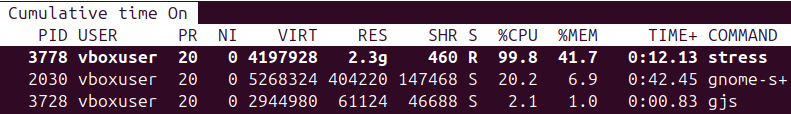
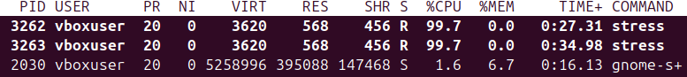
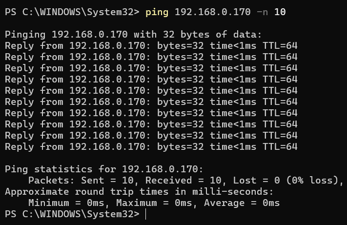
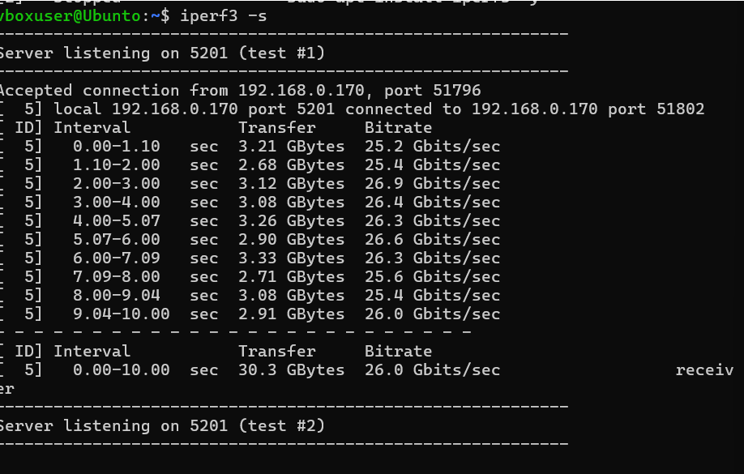
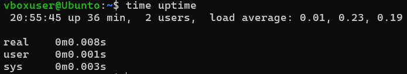

CpuandMemorytestingperformance:

BaseLineCpuand Memoryusagewhiletheserver isidle Cpu=%2.6

Memory=%6.6

ThisistheCpuand Memoryusagewhilethecpuisunder
stresstest,thishasbeendoneusing :stress– cpu2 –timeout60

Cpu=%99.7

Memory=%6.7

Memory
Stresstestusingcommand :stress –vm 1–vm-bytes4G
–timeout60,thisloads4Gygabitesofdataon theRamand stressesbothcpuand ram
for 60seconds

NetworkPerformanceTesting

Objective,istomeasurethebaselinelatencyandthroughputthenmeasurethrouhputunder
load.

Used iperf3tomonitorserver performance.

Ping192.168.0.170 -n10:

Used thistogetbasevaluesofthenetworkand howfastweretrieved
thedatausingping,whenthe server wasntunder load
wecanseethatthedataloaded fast.

Results:

Iperf3measure26Gibts/secandalso30.3transfer over 10sasshownintherun.

Interpretation,highThroughputindicatesacapablenetworkpathonthehost,asitsbridgeadaptor
thati useonthevm,ifthroughputfallsunder other loadswecanconsider
bottleneckstoCPUorvirtualization overhead.

Analysisand findings,Baselinemeasurementsshowstheserver isunder
lightloadsatrest,lowcpuand memoryusage,Under aworkload (stress--cpu2)
Cpuusagereached near fullutilisationascoreand responsetimeincreased
accordingly.Memorywastested (--vm) showed memoryusageincreadfrom
minimalload toaveryhighload of41.7indicatingram
wassufficient,Networktestingwithiperf3shows ahighthroughputof26gb.

DiskI/O Performance:

Objectivewastomeasurethebaselinediskoutput,performanceunder baselineand
under load,tofind outifstorageisabottleneck.

Iinstalled sysstatsandfio,tomeasurethediskperformance

Write(MiB/0s) =2195Mibs(2301MB’s) mainspeed metricthatthedrivecanwrite.

WriteIpos,2194Ipos,

Latency:443.9 usec,averagelatencyofthedrive

Command :fio --name=randrw--filename=/tmp/disk_testfile--size=1G
--bs=4k--rw=randrw--rwmixread=70
--direct=1--numjobs=4--runtime=60–time_based

Read speed:32.5MB/s

Writespeed:14MB/s

System Latency:

Inthisweweretryingtomeasuretheresponselatencyatidleand under load
todeterminewhether the OSresponsivenessslowsdown.

Beforeanystresstest,idlemetrics.

After stresstestingbothmemoryandCPU,thesystem latency

Results:LookingattheresultsoftheSystem
latency,wecanseeatidlethereallatencywas0.008ms
duringthestresstestwemeasured
0.003swhichisoddaswewereexpectingtoseeahigher latencyas thesystem would
havemoretohandle,these resultcould bebecausewewereonlystressing2cpu
coresand only1gb ofram whichthesystem could handlemorestress.

ServiceResponse:

