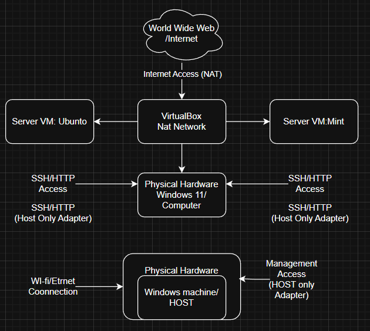
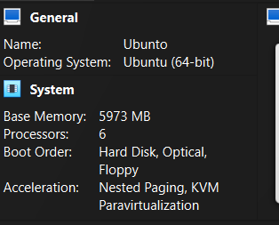
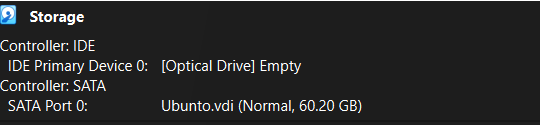
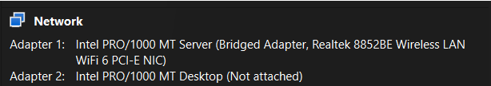
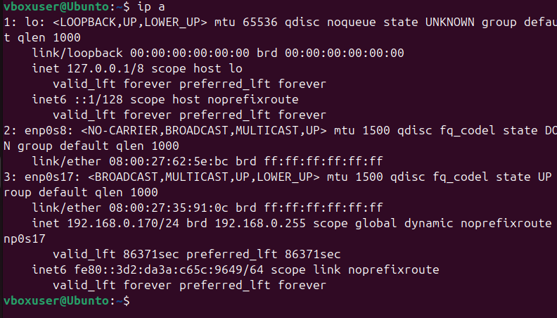
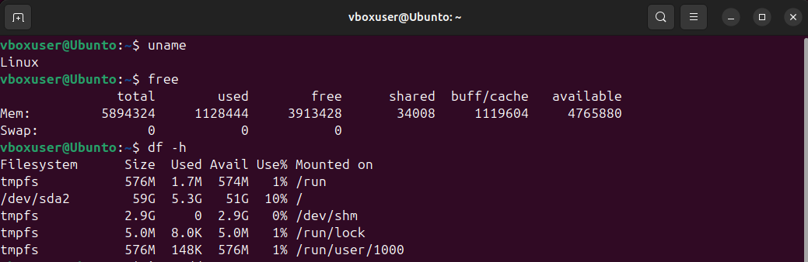
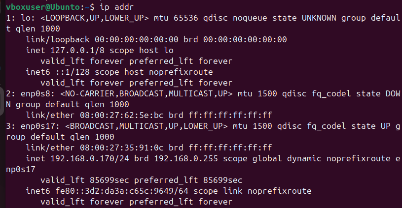

> Task1:
>
> 1.CreateaSystem ArchitectureDiagram showingbothsystemsand network
> connections
>
> Thesystem architectureconsistsoftwodifferentvirtualmachinesand
> alsoahost onWindows11,usingOracleVirtualBox.AnUbuntuServer
> virtualmachinesis deployed asa server,whileaseparateworkstationsystem
> isused for administration.
>
> Networkconnectivityisprovided
> throughViirtualBoxnetworking,withNAT enablingand
> hostonlynetwork,tohelp withsecureSSH-based management betweensystems.
>
> Task2and 3:
>
> Asmymaindistributionfor virtualmachine,IhavechooseUbunto.
>
> Ubuntoisverystableand issupported
> constantlywithupdates,ubuntoprovides5 yearsofsecurityand
> maintenanceupdates,whichreducetheoverallriskofthe system
> beingpenetratedasitsmoresecurebutalsomaintenancewise.
>
> Ubuntoalsohasastrongamountofpackageswhichoffer variousfeaturesthathelp
> withtheuser experienceasithelptracksystem performancebutalsoenhanceits
> security,someofwhichare:(opensshserver,
> ufw,fail2ban,ssystat,iperf3,fio).
>
> UbuntoSecurity,ubuntohaspackgessuchasAppArrmor whichinclud(mandatory
> accesscontroll)and alsohasfeatureslikeunattended upgred for automatic
> securitypatches,topreventold softwarebeingattacked.
>
> And asmysecond VM instanceIchoose,LinuxMint.
>
> Linuxmintisrobustand isuser friendlyisquitesimpletouseand
> nottoocomplex for beginnersGUIisamassiveadvancemakingiteasier
> tonavigate,italso maintainsstabilityand
> alsohasfeatureslikeCinnamonthat makesclientsystem
> moreefficientbyminimizingtimespentonconfiguring,
>
> Overallverygood,asituser friendlystableand reliabletouseasthesecond
> instance.
>
> UbuntoServer waschosenastheprimarysystemduetoits longterm support
> modelthathelpsguaranteefiveyearsofstabilityand
> securityupdates,tomakethe operationrisksmaller
> duringtheworkingtime,usesofthecommandlineforall server
> administrationand performancetesting.Incontrast,LinuxMintwasselected
> for theworkstationVM asitsefficient and user
> friendly,hasGUI.Thisstabilityand easeofusesimplifiestheclient
> sideadministrativetasks,and documentation while
> maintainingareliableenvironmentforaccessingtheserver for
> essentialcommand linetools.

||
||
||

||
||
||
||

> Ubunto,ishighlyknownforbegginersasithasfrendlyinterfaceisstable.
> Makesit easythroughinstallingfrom terminal,itisverysecureand
> isconstantlybeing supported withupdates.
> Beingmonolithickernelitshighinperformanceas
> everythingrunsdirectlyinkernel .
>
> Ichoseubuntoover theotherslikelinuxmint,asithasmoresupportasinupdates
> ithascommunityresourcesand itssecurityisbetter makingitbetter for
> theaverage user lastlyhoweasyitisonbeginners.
>
> Task4: Settings
>
> Inthispicture,wecanseesomebasicsystem informationthattheVM has access,
> tothisisbased onhowmuchIhavegavethesystem intheinitialsetup,Igave6GB
> or RAM (5973MB) 6Processorscores:6,andfor storageI gaveit60gb,mostof
> theseareprobablymorethanitneeded torun,butIhavechosetogiveitthismuch

> tomakesureI don'thaveanyperformanceissues,
>
> I'musingBridgeadapter asmynetworkadapter,thisusesthesameipasmyactual
> router and givetheVM accesstointernetaccess,alsoneeded later onforthe
> operationoftheSSh
>
> UsingacommandintheVM,(IPa) Ihavebeenabletochecktheip thatIhaveon theVM
> .Thiscommandalsoshowand giveother importantinformationaboutthe system.
>
> IPADD0RES:192.168.0.170/24

> Task5:runningcommandsand showingresaults
>
> Command :uname
>
> Thiscommand showthenameofoperatingsystem kernel
>
> Command :Free
>
> Thiscommand displaysthefreeand alsotheused physicalmemory,thischecks
> performanceand resourceallocationoftheUbuntuserver
>
> Command:df –h
>
> Thisshowsthestatsofthedisk, suchasdiskspaceused and theamountavailable
> ontheUbuntoServer.

