**<u>1.Create aperformance testing plandescribing your</u>** **<u>remote
monitoringmethodologyandtestingapproach:</u>**

Firstly,illneed tobeabletodotheperformanceofthecomponentssuchas CPU,
RAM, and more,illneed toseetheir resourceusagewheninidleand whenunder
load. IllbetestingtheCpu,ram,disk,networkand server
performancewithallofthem combined.

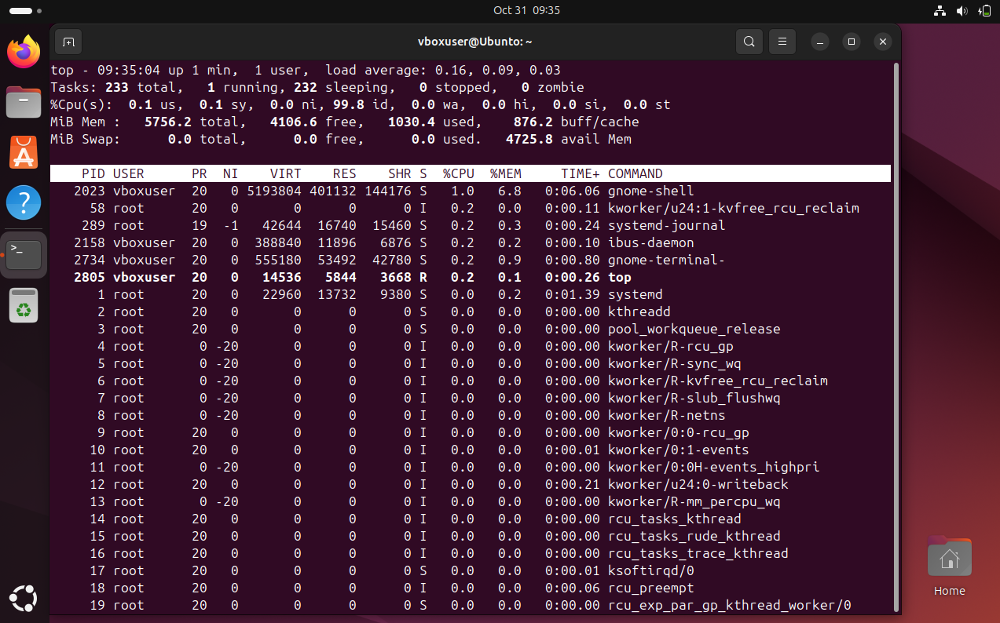-Top, isacommand
dodisplaythesystemsresourceusageshowsthingssuchas
CPU,MEMORYandmorethiswillhelp memonitor theperformance
whilstalsotesting.

-sudoaptinstallhtop,installingadifferentmodelofviewing
resources,thisinstallsthe packesfor theapplication.

-Htop,iscolourcoded and youcaninteractwiththedatamorecompared totop
soyou havemoreoptionsandmorepower .

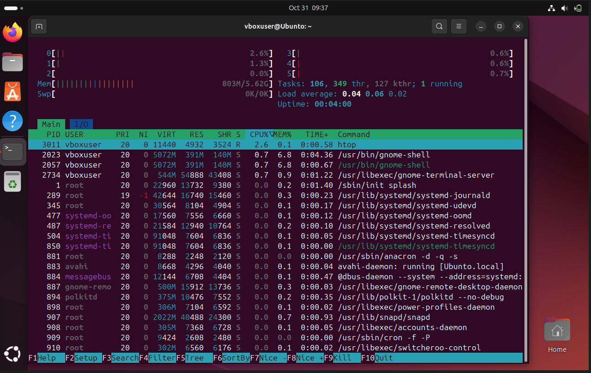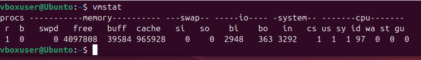

-Vmstat,reportssystem performancesuchasinputoutpucpu,
thingslikecachebuffer,
howmanyappsarewaitingforcputimeetc,isavitalcommand thatisveryhelpful for
performancetestingand evaluatingpotentialbottlenecks.

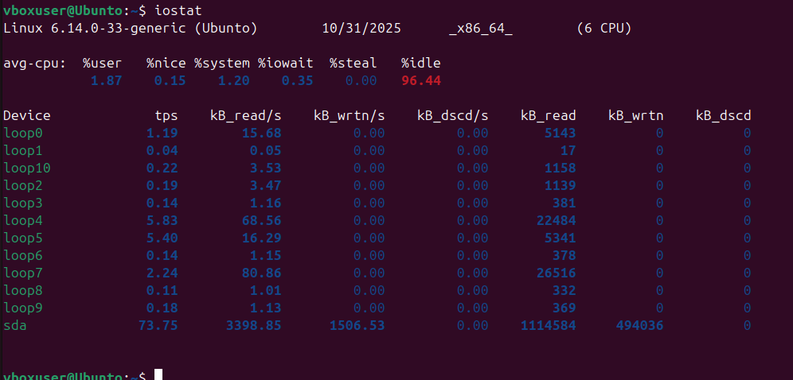-Iostat,displaystheresourcesused
byeachindividualused ifitsashared device, showsthereadand
writeofthedisk,thisprimarlyisused tochecktheperformanceof thedisk,hard
drive,ssd or m.2

sudoaptinstalliftop, installsthepackagesfortheapptobeabletorun

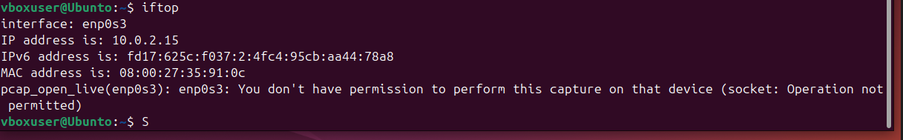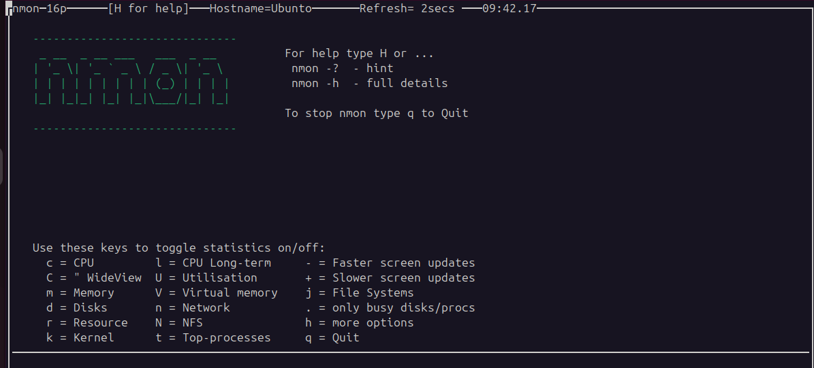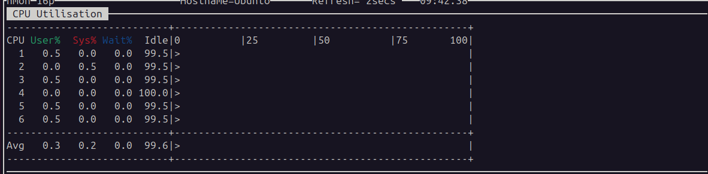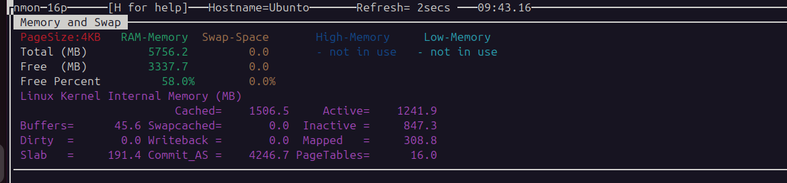

-Iftop,issupposed toshownetworkperformance,would displaybandwithusageand
more

-Sudoaptinstallnmon,installthepackagesfor theappnmon

-nmon,nmonisvery versatileitcanbeused for manythingitcanmonitor
mostofthe thingsthatalloftheother commandsdid,itsaallinone
withasemisimpleinterface.

-sudoaptinstallstress

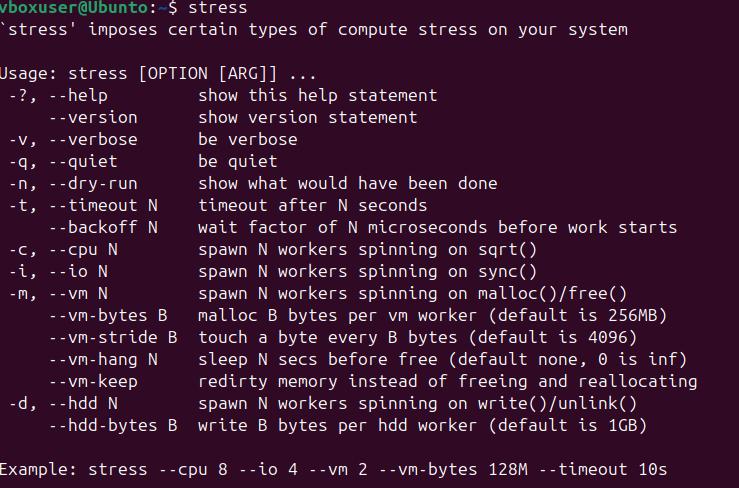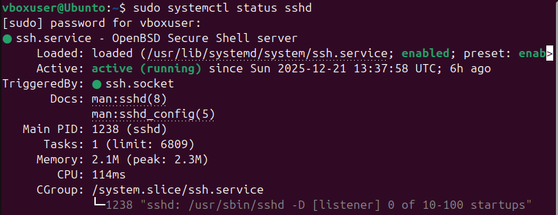

-sudoaptinstalliperf3

Iperf3,didntgettoworkproperlydidntshowmuch(dontknowhowtouse)

Proofofremotemonitoringaccesability,viaSSH

Command:sudosystemctlstatussshd

Used thiscommand tocheckiftheserver isrunningand
ifIwillbeabletoconnecttoit.

Commnad used:ssh
[<u>vboxuser@192.168.0.170</u>,](mailto:vboxuser@192.168.0.170)used
toconnecttotheSSH server

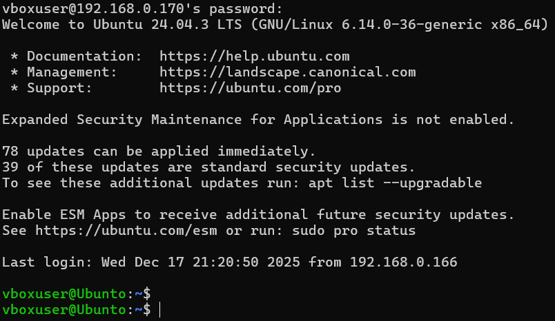

Thisprovesthatthesshserver isup and runningbutalsoproofofbeinglogged
intoit and beingabletoruncommandsasaadministrator.

**<u>Task2</u>**

||
||
||
||
||
||
||

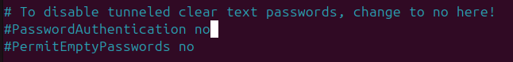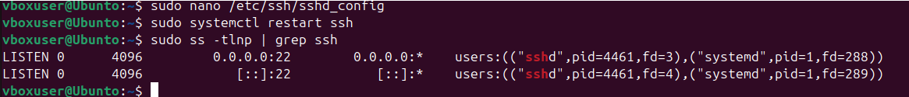

||
||
||
||

Disablerootlogging

-sudoaptupdate,updatesthesoftwatrepackges.

-sudoaptinstallopenssh-server–y -sudonano/etc/ssh/sshd_config

changeportfrom22to2222,PermitRootLoginnoandPasswordAuthenticationno,this
isasweareswitchtousingkeysinstead for authentication,thisissafer
asthekeysare encrypted and willstop brutforceattacks.

Firewall,inhereI'veinstalled thefirewallandconfigured
ittodenyallconnectionsthat dontspecificlymatchtheallowed one.
Whichwillbeconnectionfrom specifically

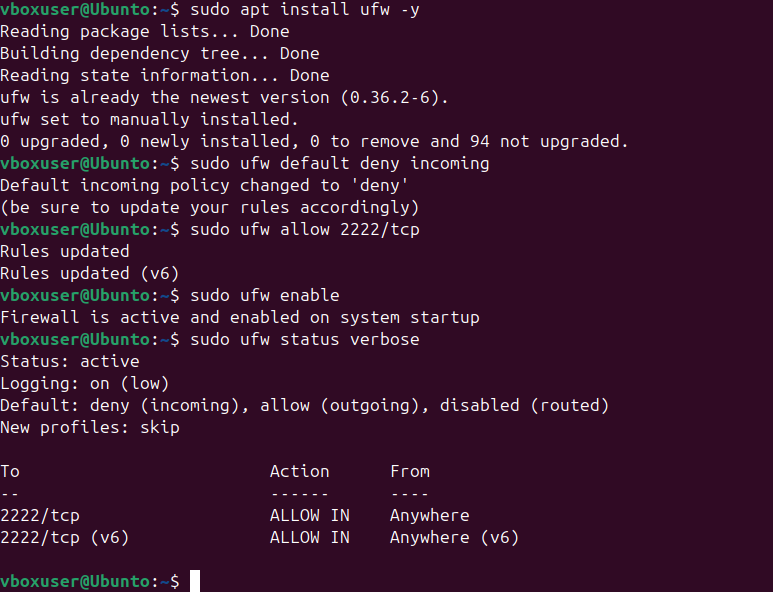port:2222

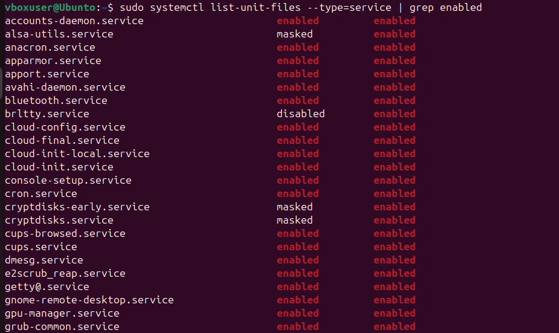

NetworkSecurity

Tsk3

1)BrutoforceSSH attacks

Theresmultiplewaythatpeoplegainunauthorised accesstosystem
thattheyshould nothaveaccessto,itsimportanttoknowhowtheydoitand
whatwecandotoprevent itfromhappening.

OneverycommonattackisBrute-ForceSSH Attacks:
Thisusuallyhappenswhenrepeated attemptstoguessSSH password
usingautomated
botstotryandguessthepassword,theyhavealgorithmswithmostcommonpassword
tomakeitmoreefficient.

ThisisverybigastheycangetUnauthorized remoteaccesswhichleadstodatatheft,
deletionor changeor changeofdata,makingdata unusable.

Howtoprotectyourselffromjustattacks: \* Disablepassword authentication

\*Changedefaultport,toreducebotscanningfor ports \*Enablefirewall(ufw)
tolimitportsallowed,and controllthenetworkactivity

\*Usingencrypted keysalsomakeitmuchharder almostimposiblefor thistowork
anymore

Thiswilllimittheattacker asitwillmakeitharder tofind theportbutalsospam
passwords.

2)PrivilegeEscalation

Another threattomany systemsthathavemanyusersisprivilegeescalation,user
accountattempttogetunauthorised administrativeaccess
bytakingadvantageofthe accessrightsthattheyhave.

Iftheymanageto,theywillhavefull control ofthesystem,and
willbeabletoaccess datadeletedownload,mightevenopenbackdoorsor
installmalware.

Howtopreventthisfrom happening:

Bydisableoftherootlogin,alsotheruleofleasprivilegeprincipleonlyallowusersto
accesswhattheyneed,alsoinstallingapparmorto restrictapplication
behaviour, meaninggivinguser theleastamountof privilegesthattheyneed
tohaveaccess,this makessurethattheused don'thaveaccessanythingthatthey
shouldn't.

3)DenialofServiceDOS

Thishappensbyattackersfloodingthenetworkwith
loadingmaterialssuchasloading
theCPU,memory,diskcausingtheperformancetogodownor evenstop.

Thisleadstosystem slowdownor
evencompletefailureduetooverload,interruptionof accesstothesystem and
intheworstcasescenariohardwaredamagebutunlikely.

Howtostop thesetypesofattacks:

Byenablingthefirewalltopreventspamofunwanted traffic/suspicious.

Usingperformancemonitorstoolstocheckifanythinglooksodd
Automaticupdatespreventold system beingattacked from older
softwarethathas exploitstogetunathorised access

Apparmor tolimitresoursemisuse

Thesestepswillmakethesystem morestableand willmakeitharder for
Dosattacksto

occur.
