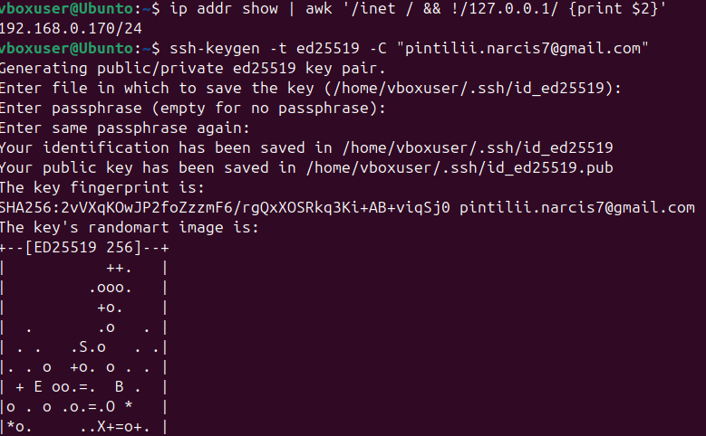
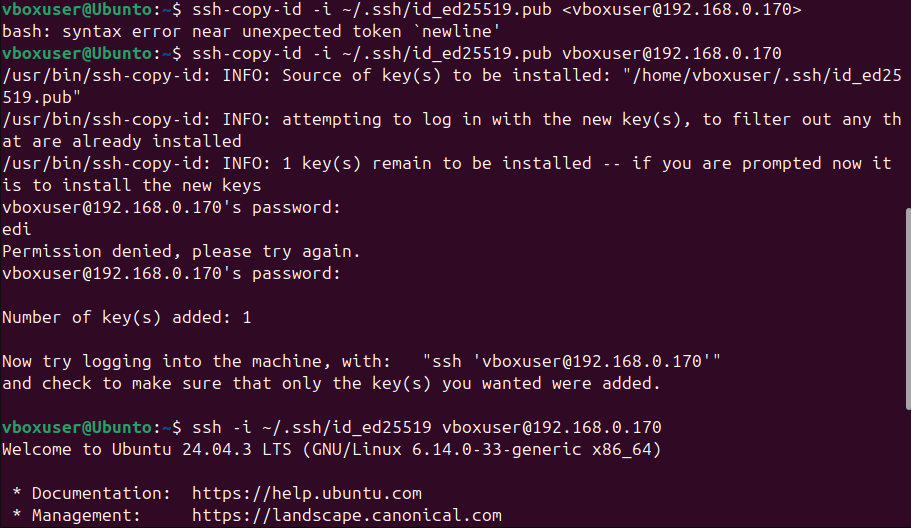
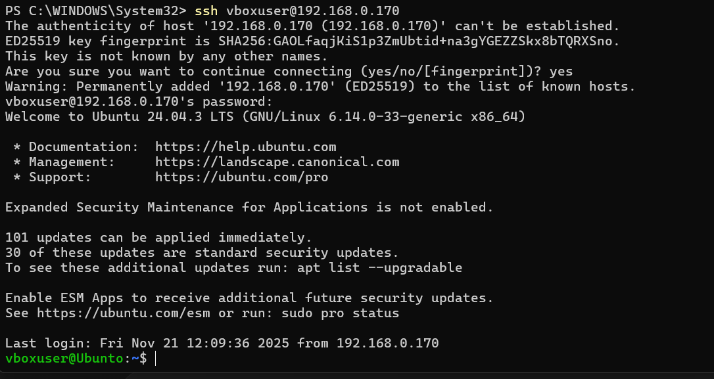
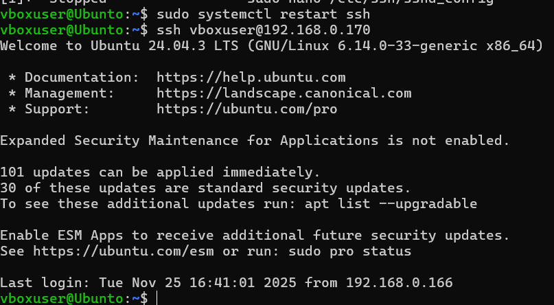
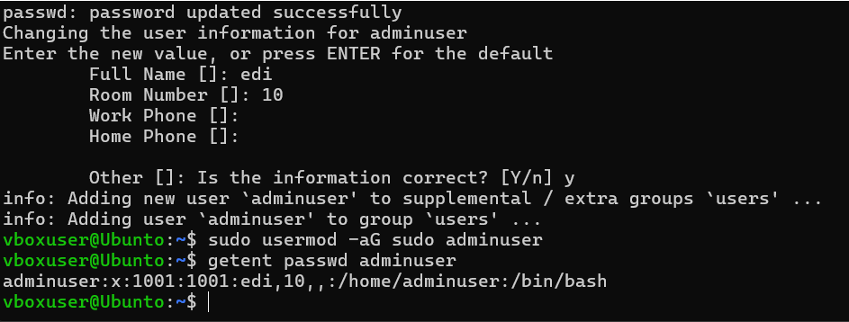
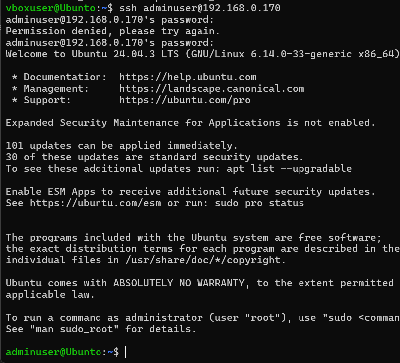
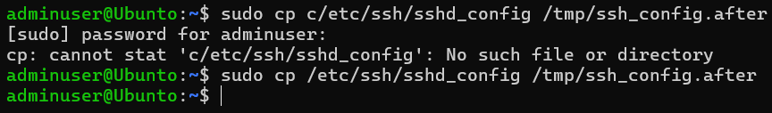
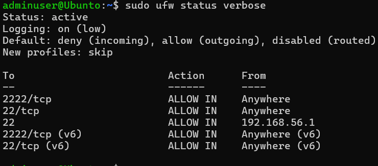
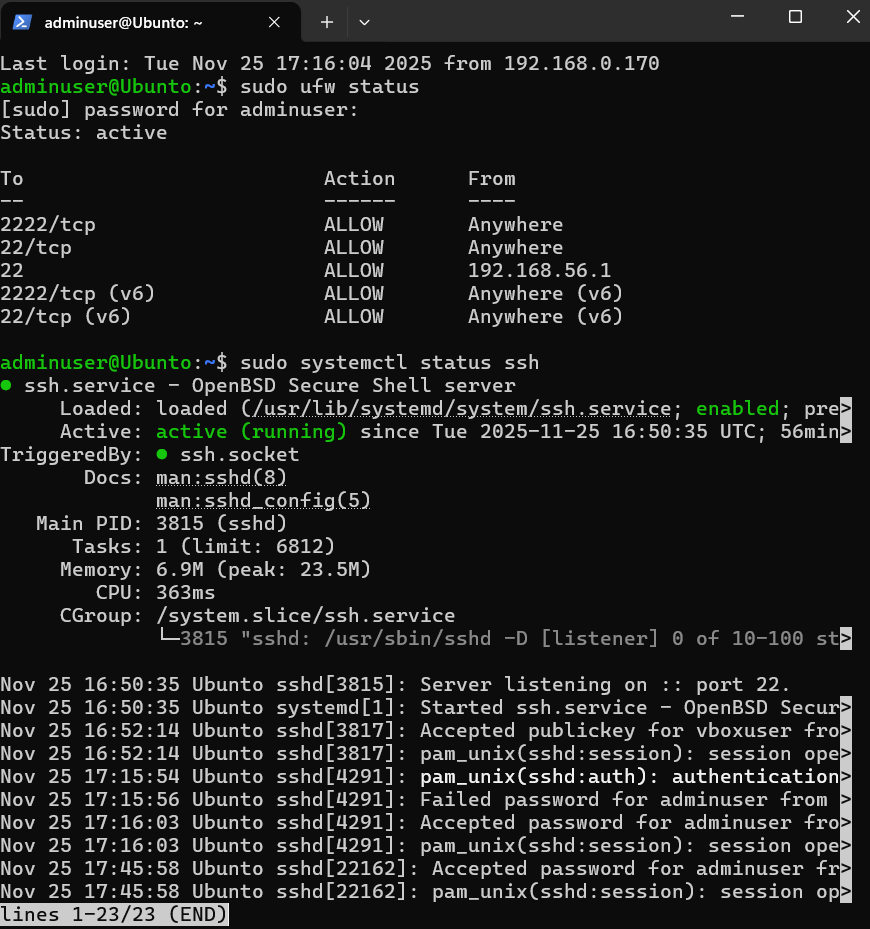

**Week 4 — Remote Administration & Security (Tasks 1–7)**

**Server:** Ubuntu VM (headless) — 192.168.0.170

**Workstation:** Windows 10/11 (PowerShell)

**Objective:** Deploy the server and implement foundational security controls. Document all work performed **over SSH** from the workstation, provide before/after configuration comparisons, capture screenshots of successful SSH sessions and commands, and produce a clear evidence bundle for the recorded demonstration.

**Summary of tasks completed**

> 1. Configure SSH with key-based authentication  
> 2. Configure UFW firewall permitting SSH from one specific workstation only  
> 3. Create a non-root administrative user and configure sudo privileges  
> 4. SSH Access Evidence (screenshots + command outputs)  
> 5. Configuration Files with before/after comparisons (/etc/ssh/sshd_config, ufw rules)  
> 6. Firewall Documentation showing complete ruleset  
> 7. Remote Administration Evidence demonstrating commands executed via SSH

Task 1 – Ssh key based authentication

In this task will replace password authentication with public key authentication for remote login.

Ssh-keygen –t ed25519 –C <u>pintilii.narcis7@gmail.com</u> command to create key pair on the shell workstation

Ssh-keygen creates a public/private key pair. The public is installed in ~/.ssh/authorized_keys on the server.

chmod command enforces secure permissions on the keys directory and file

1 -------------------------

Task 2 – Firewall: allow SSH only from workstation

In this task I will make the firewall allow ssh from one trusted admin.

In the screenshot I connected to the ssh server from shell.

Disabled password authentication, PermitRootLogin no, and pubkey authentication yes.

I also edited /etc/ssh/sshd_config and disabled PasswordAuthentication and PermitRootLogin and ensured PubkeyAuthentication is enabled, then restarted the server.

In the next screenshot I allowed a specific IP with a specific port and added it to the firewall to allow remote login, also used sudo ufw enable to enable the firewall.

Also checked its status with sudo ufw status numbered.

Task 3 - User management and privileges

The goal of this task was to create a new admin user, and give him some privilege management.

Commands: sudo adduser adminuser

sudo usermod –aG sudo adminuser getent passwd adminuser

Adduser creates a new account and usermod –aG sudo adds the user to the sudo group for admin privileges.

Task 4 connected to the new admin user that was created in the task above

Task 5 – configure files: before & after

Before and after saved files of the /etc/ssh/sshd_config

Task 6 – Firewall documentation

Commands:

sudo ufw status verbose  
The ufw verbose outputs, label each rule and describes what it is for

