Task 1: AppArmor Config and testing

Objects

To enable AppArmor, verify it is running and test how it logs security events before and after executing.

For this task I have implemented a few new features, which are Mandatory access control and this is using AppArmor, this help me set rules for different people and role, which reduce their abilities to access things outside their job role (access to only what you need), this helps reduce attacks.

I made sure in the lines below that AppArmor was installed and activated in on the Ubuntu VM. Looked at the list of active security modules.

Checked if AppArmor was running.

- sudo apt update  
- sudo apt install -y apparmor apparmor-utils  
- sudo apt install -y auditd audispd-plugins  

These give access to commands like apparmor-utils, aa-status, aa-enforce, aa-complain, aa-logprof and auditd and ausearch.

sudo systemctl enable --now apparmor  

sudo systemctl status apparmor --no-pager  

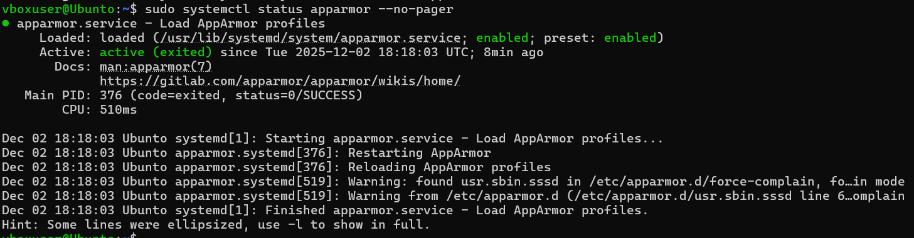

sudo aa-status – this shows the number of loaded profiles, and how many programs are in enforce or complain and lists profiles.

sudo apparmor_status  

ls -l /etc/apparmor.d | sed -n '1,200p'  

sudo aa-status | sed -n '/profiles are in enforce mode/,$p' || true  

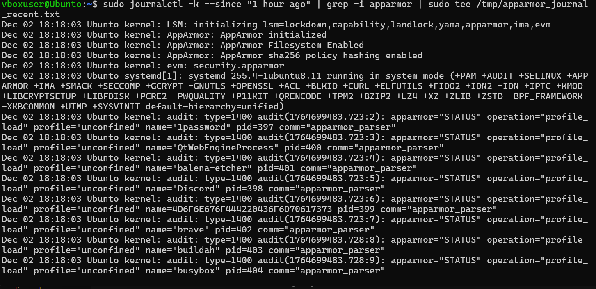
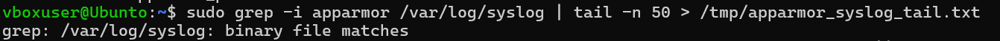

sudo journalctl -k --since "1 hour ago" | grep -i apparmor | sudo tee /tmp/apparmor_journal_recent.txt  

sudo grep -i apparmor /var/log/syslog | tail -n 50 > /tmp/apparmor_syslog_tail.txt  

sudo aa-complain /etc/apparmor.d/usr.sbin.apache2  
sudo aa-status | grep -i apache -n || true  

To ensure the system was actually enforcing security policies, by using the command sudo aa-status. This confirmed that 57 profiles were in “enforce mode,” meaning AppArmor is blocking restricted actions, not only just logging them.

Then with journalctl I looked at the audit logs and also grep to make sure that AppArmor was started correctly and logs all the events. This shows that the kernel is correctly tracking application behavior and is ready.

Confirms mode change.

I observed that:

AppArmor was active and that it was loading profiles.  
Logs showed status: profile load messages meaning that AppArmor was working.  
The test was completed and AppArmor functionality was verified even without blocked events.

Task 2:

To make sure that the server remains secure against new possible vulnerabilities without requiring constant manual intervention I have activated automatic security updates. I installed unattended upgrades and set it up with dpkg-reconfigure to download and install critical security updates. This is vital to make sure any new threats are being caught.

I verified the configuration by checking the 20auto-upgrades files, which confirmed that the update list and the upgrades are set to start by themselves. Then lastly I checked the log file to make sure the service was working. This setup makes sure the server stays up to date against the newest type of threats, even when not logged in or updating manually.

Objective:

To enable automatic system updates so the machine stays secure.

sudo apt update  

sudo apt install unattended-upgrades -y  

sudo dpkg-reconfigure --priority-low unattended-upgrades  

Observation: automatic updates successfully enabled. The configuration file confirmed.

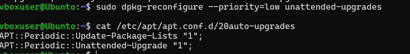
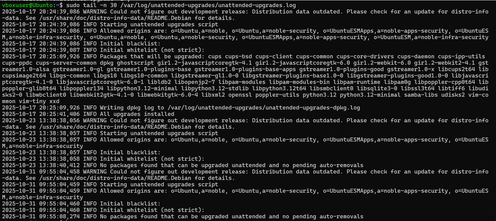

sudo tail -n 30 /var/log/unattended-upgrades/unattended-upgrades.log  

Task 3: Configure Fail2Ban

In this task I installed and configured Fail2Ban to protect the SSH connection from being attacked from things like brute force. Fail2Ban works by scanning log files for repeated failed login attempts and updating the firewall to ban if there are too many failed attempts from a specific IP, then the IP is banned to prevent them from continuing the attack.

After installing it, I made sure the server is running with “systemctl status fail2ban”. Then I used “fail2ban-client status sshd” to check the SSH connection and its jail. This showed me that the filter is working and looking for potential attacks. This is another layer of security that helps the overall system to make sure it remains protected against automatic blocking bots or attackers trying to guess passwords.

Objective: Install and configure Fail2Ban on the server to protect SSH against brute-force attacks.

Below there is picture with some of the things I've done to do this.

sudo apt install fail2ban - installs the packages necessary to run Fail2Ban  

sudo systemctl restart fail2ban  

sudo systemctl status fail2ban  

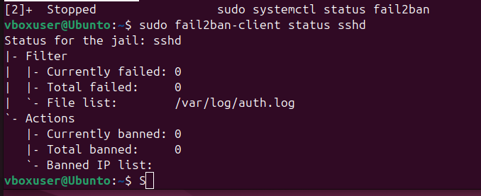

sudo fail2ban-client status sshd  

These are the commands I've used to get Fail2Ban installed, also added some things into the local file of Fail2Ban to make it more secure. In the screenshot below you'll be able to see that Fail2Ban is up and running.

Task 4: Security

Manual security checks can be done by humans but can have errors, so by creating a script to automate the verification of the server's security. This script will check the status of the main services and checks that SSH is active, checks the firewall is working, to lastly checks Fail2Ban is running too.

This way it makes sure that every time the script is being run, all our levels of security are being checked to make sure they are active and running. If any services fail this script would immediately show the missing security control allowing for quick comeback. This helps reduce human error, also makes it much quicker and more efficient by typing and running one single script you can find out a lot of information.

I created a script that is called securitybaseline.sh.

I made the script executable and also executed it via SSH to validate the server security baseline.

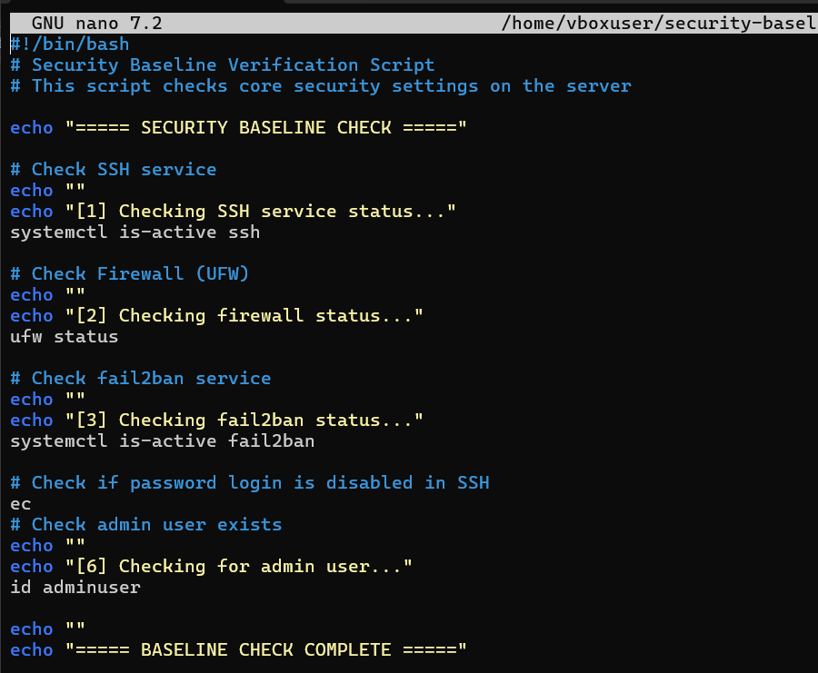
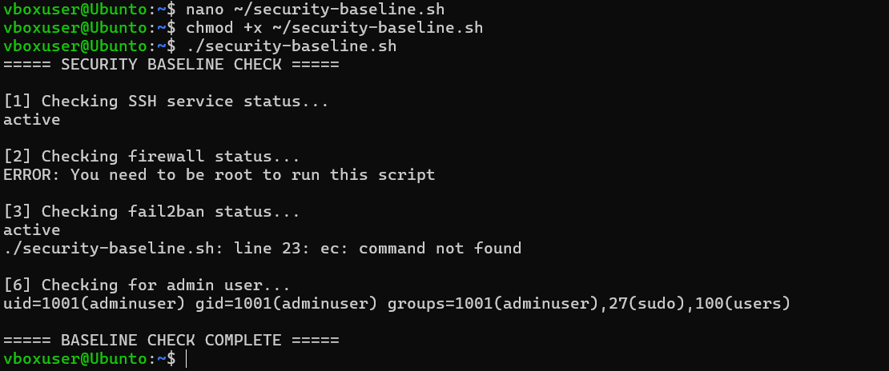

Task 5: Remote Monitoring Script

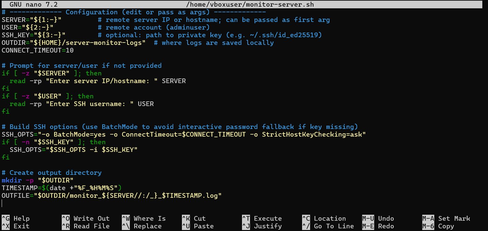

To enable remote admin without needing direct console access, I made a script that utilizes SSH to connect to the Ubuntu server, executed performance commands like CPU, memory and disk space and saves the output to a local log file.

This way it allows me to create a snapshot of the server health over time. By running the script I gather metrics in time and logged in users and resource consumption, showing that I can monitor the server performance securely from a remote location.

Objective: Was to create and run a script from my laptop that connects to the Ubuntu server with SSH and collects performance metrics remotely.

Script: the script monitors the server's performance, it is named monitor-server.sh. The script connects to the server using SSH and gathers system performance information such as:

CPU load  
Memory usage  
Disk usage  
System uptime  
Logged-in users  

Command used to create script: nano ~/monitor-server.sh  

Command used to make the script executable: chmod +x ~/monitor-server.sh  

I executed the file to connect remotely and collect metrics.

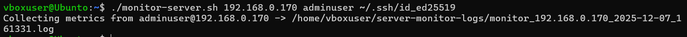
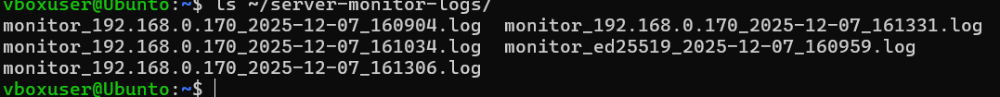

Verification of log file

This task demonstrated successful remote monitoring using SSH from my laptop. The script collected and stored system performance metrics from the server, verifying secure remote administration and monitoring abilities.
