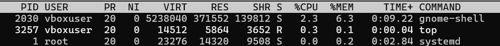
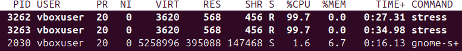
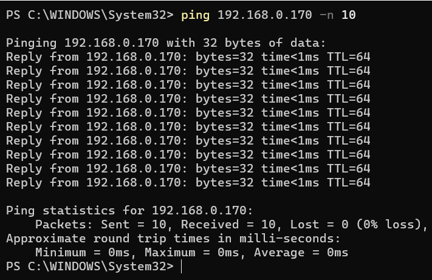
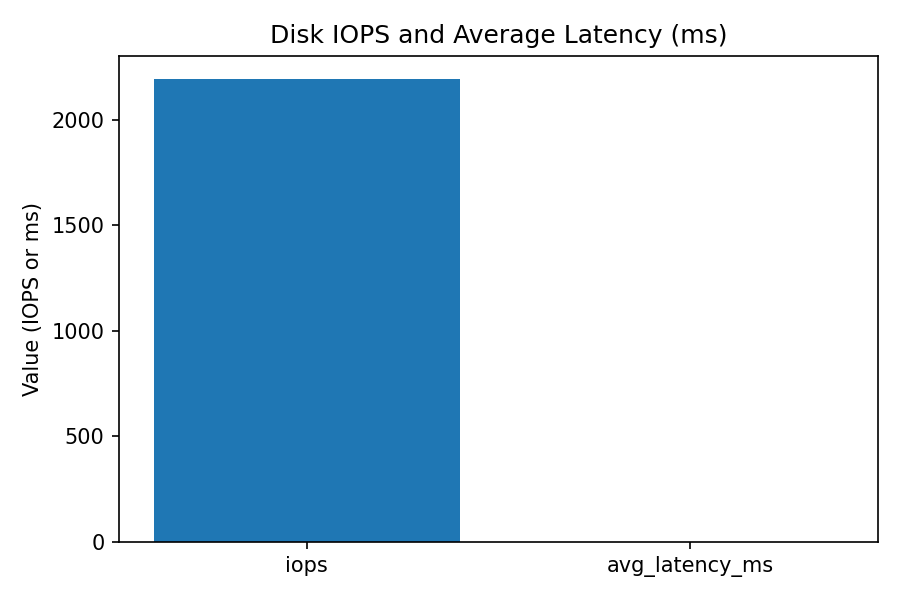
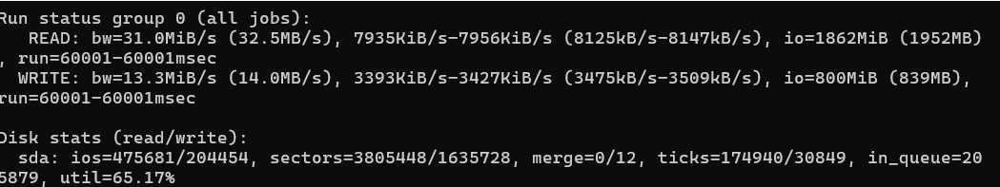
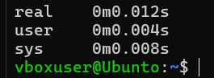

Cpu and Memory testing performance:

Base Line Cpu and Memory usage while the server is idle  
Cpu = %2.6

Memory = %6.6

This is the Cpu and Memory usage while the cpu is under stress test, this has been done using :stress– cpu2 –timeout60

Cpu = %99.7

Memory = %6.7

Memory Stress test using command :stress –vm 1–vm-bytes4G –timeout60, this loads 4Gygabites of data on the Ram and stresses both cpu and ram for 60 seconds

Network Performance Testing

Objective, is to measure the baseline latency and throughput then measure throughput under load.

Used iperf3 to monitor server performance.

Ping 192.168.0.170 -n 10:

Used this to get base values of the network and how fast we retrieved the data using ping, when the server wasnt under load we can see that the data loaded fast.

Results:

Iperf3 measure 26Gi bts/sec and also 30.3 transfer over 10s as shown in the run.

Interpretation, high Throughput indicates a capable network path on the host, as its bridge adaptor that i use on the vm, if throughput falls under other loads we can consider bottlenecks to CPU or virtualization overhead.

Analysis and findings, Baseline measurements show the server is under light loads at rest, low cpu and memory usage. Under a workload (stress--cpu2) Cpu usage reached near full utilisation as core and response time increased accordingly. Memory was tested (--vm) showed memory usage incread from minimal load to a very high load of 41.7 indicating ram was sufficient. Network testing with iperf3 shows a high throughput of 26gb.

Disk I/O Performance:

Objective was to measure the baseline disk output, performance under baseline and under load, to find out if storage is a bottleneck.

I installed sysstats and fio, to measure the disk performance

Write (MiB/0s) = 2195 MiBs (2301MB’s) main speed metric that the drive can write.

Write Iops, 2194 Iops,

Latency: 443.9 usec, average latency of the drive

Command :fio --name=randrw--filename=/tmp/disk_testfile--size=1G --bs=4k--rw=randrw--rwmixread=70 --direct=1--numjobs=4--runtime=60–time_based

Read speed: 32.5 MB/s

Write speed: 14 MB/s

System Latency:

In this we were trying to measure the response latency at idle and under load to determine whether the OS responsiveness slows down.

Before any stress test, idle metrics.

After stress testing both memory and CPU, the system latency

Results: Looking at the results of the System latency, we can see at idle the real latency was 0.008 ms. During the stress test we measured 0.003 s which is odd as we were expecting to see a higher latency as the system would have more to handle. These results could be because we were only stressing 2 cpu cores and only 1 gb of ram which the system could handle more stress.

Service Response:

Ways to optimize system performance:

Optimization 1: Stop unused services

I checked active system service and have disabled all the background apps and services that are unused and disabled them as they are using system resources with no purpose and its a waste. The results showed lower background CPU usage and slightly improved response time for short commands an expected gain where it reduces overhead.

Optimization 2: Set CPU governor to performance

To reduce frequency scaling latency I applied the performance CPU governor for the duration of the test. This keeps CPU frequency high and reduces ramp up latency for workloads. The results showed reduced command latency (ms) and slightly more stable throughput under load. The tradeoff is higher power use and temperature; this change was applied temporarily for measurement and document.
