Inthisweek7idid afocused securityauditontheubuntoheadlessserver.Iused
toolslikelynisand nmap whicharesecuritytools,and alsochecked
thingsmanuallylikesshconfig,ufwrules,fail2ban, apparmor and
logs.Alltheoutputsand screenshotsicollected arestored inafolder called
\$EVID.The mainaim wastoseehowsecurethesystem wasbefore,find openportsor
weaksettings,and thenfix theimportantproblemsthatcould bearisk.

Whenifirstranlynisthehardeningindexwas60whichmeansthesystem
wasmissingsome recommended securitysettings.From thenmap
scanisawthatport22for sshwasopenwhichis expected,butalsoport80for
apachewaslisteningwhichisnotneeded for thisserver.Inthessh
configurationPermitRootLoginwasalreadysettonowhichisgood,but
PasswordAuthentication wasstillenabled whichisnotsecure.UFWwasenabled
butthesshruleswereabittooopen,while fail2banand apparmor
werealreadyrunningonthesystem.

After findingtheseissuesiapplied fixesusingsshonly.Idisabled password
based sshloginand enforced
keyonlyauthentication,keepingrootlogindisabled.Istopped and disabled
apachebecause theserver doesnotneed aweb serviceand thisreduced
theattacksurface.Ialsorestricted sshaccess
inufwsoonlymyworkstationIPisallowed toconnect.After
thisiranlynisagainandthehardeningscore increased
to61whichshowssomeimprovementevenifsmall.Asecond nmapscanconfirmed
thatport 80isnowclosed and onlysshisaccessible.

Ialsochecked therunningservicesand justified whytheyareneeded
suchassshforadministration, loggingservices,fail2banandapparmorfor
security.Anyservicethatwasnotneeded wasremoved.
Therearestillsomeremaininglowriskwarningsfrom lyniswhicharedocumentedand
could be improved later,suchasmoreregular auditsand
logmonitoring.Overallthisauditshowsthatthesystem securitywasimproved
andtheconfigurationismoresuitableforaheadlessserver.

**Service** **inventory(table** **—paste** **this,thenfill)**

> **Service** **name**
>
> sshd
>
> fail2ban
>
> apache2
>
> apparmor
>
> **Role**

Remote administration Brute-force protection

Web server

Mandatory access

control

> **Running?**

running

running

stopped/disabled (after)

running/enforced

> **Justification**

Required;hardened withpubkey authand firewallrestriction

Blocksrepeated SSH attempts

Notrequired for server rolein coursework

Providesprocessconfinement

> **Actionif** **not** **required**

Keep enabled

Disabled

Keep

enabled

NMAP:

Mappingtomarkingcriteria:Thisweek7submissionimplementsallthenecessarysecuritycontrolls
suchas:SSH,KEY AUTHENTICATION,ACCESSCONTROLL viaAppArmor,fail2banand
alsoincluded automated updates,Asecurityauditwascompleted and
remediatedperformancewithLynisimproving from 60to61.Cliusageand
scriptsused for evidencecollectionaredocumented inearlier weeks.

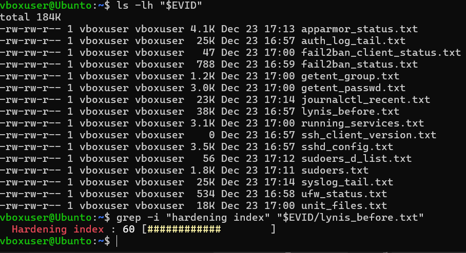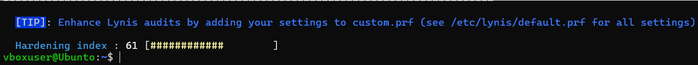Bellow,aretheresultsand
proofofrunningmostofthecommandsnecessary,alsoproofofperformance
improvementsand theservicesthatarerunning.

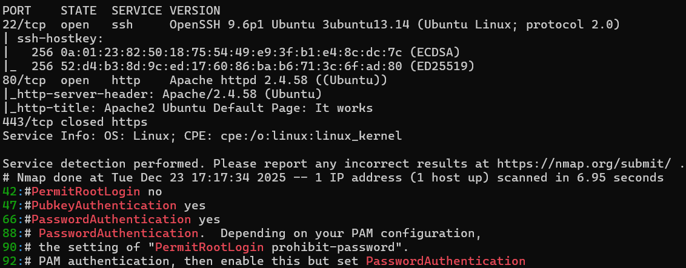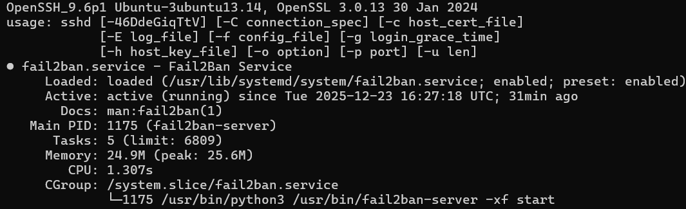

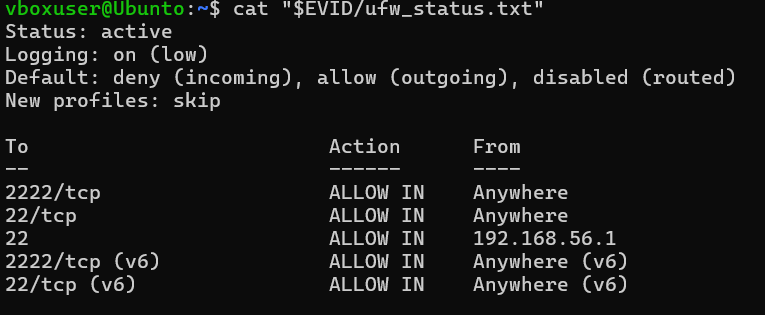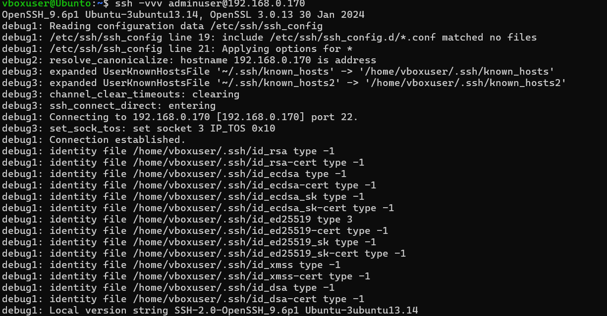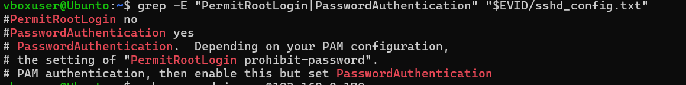

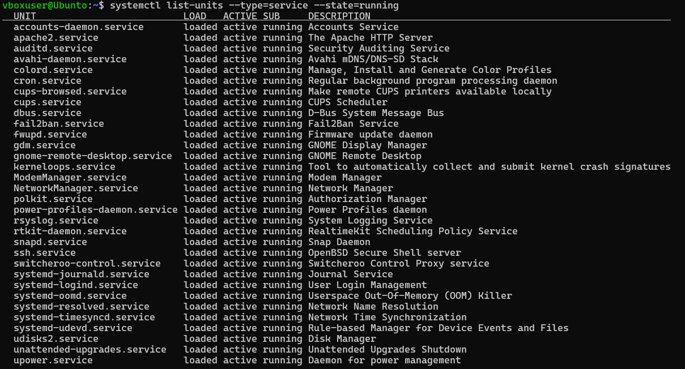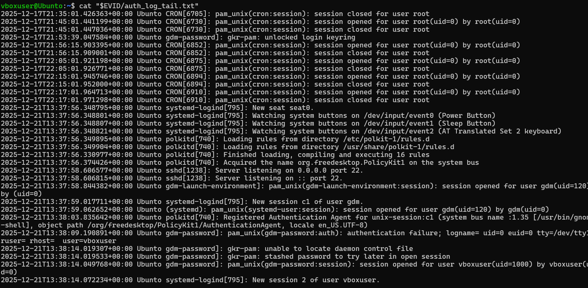

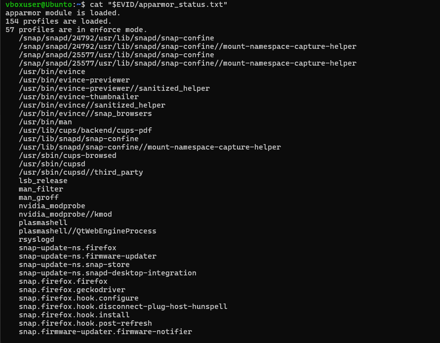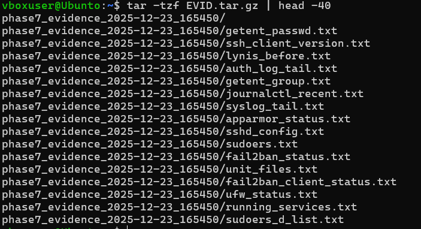

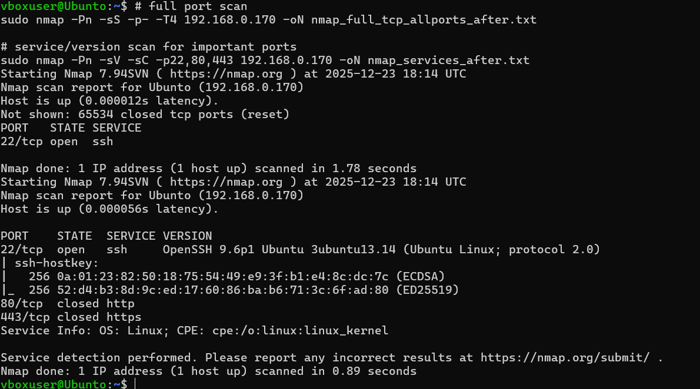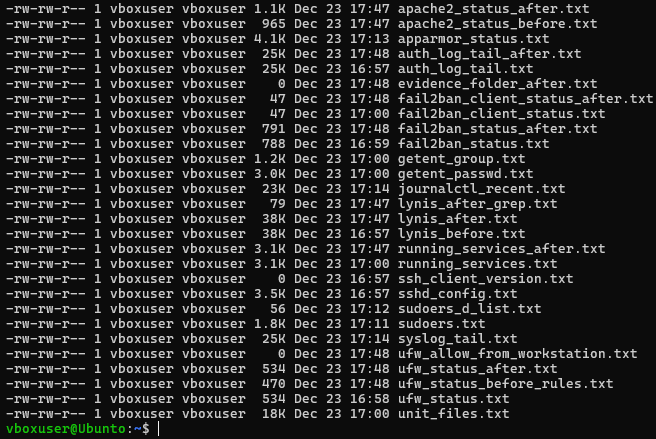
